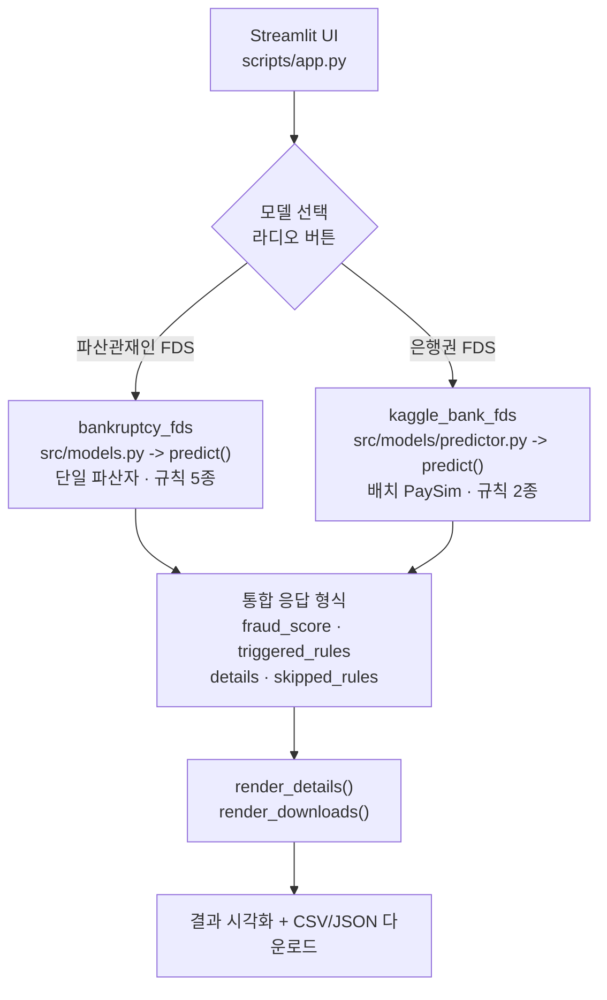

# 이중 모델 사기 탐지 시스템 (FDS)

**서로 다른 두 도메인의 사기 탐지 모델을 하나의 Streamlit 애플리케이션으로 통합한 실시간 위험도 평가 시스템.**

## 개요

이 프로젝트는 운영 환경에 배포 가능한 사기 탐지 시스템으로, 두 가지 이질적인 도메인 특화 모델을 하나로 통합합니다.

- **파산관재인 FDS**  (`bankruptcy_fds`): 파산 사건의 의심 거래 패턴을 탐지하는 규칙 기반 시스템 (계층화 거래, 관계자 거래, 분산 이체, 거래 속도 급증, 시간대 이상)
- **은행권 FDS**  (`kaggle_bank_fds`): PaySim 거래 패턴을 이용한 사기 탐지 (전체 잔액 이체, 이체 후 즉시 현금화)

### 프로젝트의 의미

물류 산업에서 **6년 6개월간 실무 경험**을 쌓는 동시에, 한국방송통신대학교 융합경영학부(마케팅/애널리틱스 전공)에 편입하여 데이터 분석 수업을 듣게 되었습니다. 그 과정에서 금융 거래 데이터의 패턴 분석이 얼마나 중요한지 알게 되었습니다.

더 깊이 있게 현실을 이해하기 위해, 파산 관재인 업무를 담당하는 변호사 형에게 실무 이야기를 듣기 시작했습니다. 형으로부터 관재인 업무 수행 중 부정거래 탐지의 비효율성과 그로 인한 조사 비용 증가, 의심 거래의 적시 적발 어려움 등 여러 Pain Point를 알게 되었습니다.

결론적으로, **물류 도메인과 법금융 도메인 모두에서 사기 탐지 기술이 얼마나 중요한 문제인지**  깨달았습니다. 이러한 문제 의식과 호기심을 바탕으로 이 프로젝트를 기획하고 진행하게 되었습니다.

---

## 아키텍처



**핵심 설계 결정**

1. **통합된 predict() 인터페이스**  — 두 모델 모두 `{fraud_score, triggered_rules, details}` 형태로 반환
2. **규칙별 결함 격리**  — 각 규칙을 try-except로 감싸서 한 규칙의 실패가 전체 파이프라인을 멈추지 않음
3. **도메인 매핑**  — `render_details()`와 `render_downloads()`가 스키마 차이 처리 (거래ID 존재 여부, evidence_ids 의미 차이)

---

## 핵심 기능

### 견고한 에러 처리

- **규칙 단위 격리**: 문제 있는 규칙 감지 → 로깅 → `skipped_rules`에 기록
- **우아한 성능 저하**: 성공한 규칙으로만 사기 점수 계산
- **추적 가능성**: 모든 스킵된 규칙과 에러 메시지는 JSON 파일에 보존

### 통합 Streamlit UI

- **모델 선택**: 라디오 버튼으로 파산/은행 모델 전환
- **유연한 입력**: CSV 업로드 또는 도메인별 샘플 데이터 사용
- **결과 시각화**: 사기 점수 메트릭, 적용 규칙 목록, 규칙별 상세 (펼침 가능)
- **이중 내보내기**: CSV (보고용) 또는 JSON (상세 분석용) 다운로드

### 테스트 주도 개발

- **bankruptcy_fds**: 16개 테스트 통과 (규칙별 정상/경계/예외 케이스)
- **kaggle_bank_fds**: 4개 테스트 통과 (정상 케이스, 빈 데이터, 규칙 실패 격리)
- **회귀 방지**: 규칙이 예상치 않게 실패해도 나머지 판단은 유지되는지 검증

---

## 기술 스택

| 요소 | 기술 | 목적 |
|------|------|------|
| 백엔드 | Python 3.11 | 핵심 로직 |
| UI | Streamlit | 대시보드 |
| 데이터 | pandas, numpy | 거래 처리 |
| 규칙 | 커스텀 규칙 엔진 | 사기 탐지 |
| 점수화 | RiskScorer 클래스 | 위험도 통합 |
| 테스트 | pytest | 자동 검증 |
| 개발 환경 | PyCharm + Claude Code MCP | 개발 도구 |
| 버전 관리 | Git | 저장소 관리 |

---

## 빠른 시작

### 설치

```bash
git clone https://github.com/NoahBhang/FDS-learning-framework.git
cd FDS-learning-framework

python3.11 -m venv .venv
source .venv/bin/activate

pip install -r requirements.txt
```

### 앱 실행

```bash
streamlit run scripts/app.py
```

브라우저에서 http://localhost:8501 이 자동으로 열립니다.

### 테스트 실행

```bash
python -m pytest bankruptcy_fds/tests/ kaggle_bank_fds/tests/ -v
```

### 사용해보기

1. **모델 선택** — 왼쪽 사이드바에서 라디오 버튼 클릭
2. **데이터 업로드** — CSV 업로드 또는 샘플 데이터 사용
3. **결과 확인** — 사기 점수, 적용 규칙, 규칙별 상세 정보
4. **내보내기** — CSV 또는 JSON 다운로드 버튼 클릭

---

## 프로젝트 구조

```
FDS_Model/
├── bankruptcy_fds/
│   ├── src/
│   │   ├── models.py                    # predict() 진입점
│   │   ├── pipelines/
│   │   │   └── fraud_detection_pipeline.py
│   │   ├── rules/
│   │   │   ├── layering.py              # 계층화 자금 이동
│   │   │   ├── related_party.py         # 관계자 거래
│   │   │   ├── split_transfer.py        # 분산 이체
│   │   │   ├── velocity_spike.py        # 거래 속도 급증
│   │   │   └── temporal_anomaly.py      # 야간·주말 집중
│   │   ├── scoring/
│   │   │   └── risk_scorer.py
│   │   └── ui/
│   ├── data/
│   │   └── sample_transactions.csv
│   └── tests/                           # 16개 테스트
│
├── kaggle_bank_fds/
│   ├── src/
│   │   ├── models/
│   │   │   └── predictor.py             # predict() 진입점
│   │   ├── rules/
│   │   │   ├── full_balance_transfer.py
│   │   │   └── transfer_cash_out.py
│   │   ├── scoring/
│   │   │   └── risk_scorer.py
│   │   └── evaluation/
│   ├── tests/                           # 4개 테스트
│   └── scripts/
│       ├── run_demo.py
│       └── benchmark_fds.py
│
├── scripts/
│   └── app.py                           # 통합 Streamlit UI
│
├── shared/
│   ├── models/
│   │   ├── debtor.py
│   │   └── transaction.py
│   └── rules/
│       └── base_fraud_rule.py
│
├── database/
│   ├── schema.sql
│   └── verified_window_functions.sql
│
├── .gitignore
├── README.md
├── CLAUDE.md
└── requirements.txt
```

---

## 설계상의 도전 과제와 해결

### 문제: 호환되지 않는 두 모델, 하나의 UI

- `bankruptcy_fds`는 단일 파산자 컨텍스트가 필요합니다 (LayeringRule의 BFS가 출발 노드를 요구)
- `kaggle_bank_fds`는 배치 지향입니다 (PaySim은 계좌 간 self-merge와 집계 기반)
- 스키마 불일치: 파산자 ID 존재 여부, `evidence_ids`의 의미 차이, 규칙 의존성

### 해결

1. **통합 predict() 시그니처**  — 내부 복잡성을 일관된 인터페이스 뒤에 숨김
2. **도메인 인식 렌더링**  — 같은 `render_details()`가 두 모델을 모두 처리하되, 증거 열 로직만 모델별로 분기 (`evidence_col=None`이면 행 인덱스로 매핑)
3. **결함 격리**  — 규칙 실패를 `skipped_rules`에 기록하고 나머지 판단은 계속 진행

### 왜 이 문제가 중요한가

부정거래 탐지 실무에서는 서로 다른 출처의 규칙과 모델이 계속 추가됩니다. 이때 각 모델의 스키마를 하나로 강제하는 대신, 서빙 계층에서 인터페이스를 통일하고 도메인 차이는 렌더링 단계에서 흡수하는 방식이 유지보수 비용을 낮춥니다. 또한 규칙 하나가 실패했을 때 전체 판단이 중단되면 조사 자체가 멈추므로, 부분 실패를 감수하되 그 사실을 명시적으로 드러내는 설계가 실무에 더 적합합니다.

---

## 향후 로드맵

### 1. 규칙 확장

파산관재인 FDS에 추가 예정인 탐지 패턴:

- 교차 파산자 담합 (그래프 알고리즘 기반 네트워크 분석)
- 자산 은닉 의심 패턴 (신청일 직전 대규모 처분)

### 2. 배치 처리 병렬화

순차 처리를 `ProcessPoolExecutor` 기반으로 전환합니다. 현재 O(n) 순차 처리를 O(n/P) 병렬 처리로 개선하는 것이 목표입니다 (P는 프로세스 수).

벤치마크 환경: MacBook Air M5, 파산자 1000명 기준

### 3. 설명 가능성 강화

SHAP/LIME을 적용해 어느 규칙 요소가 사기 점수에 가장 크게 기여했는지 시각화합니다. 관재인이 판단 근거를 검증할 수 있어야 실제 조사에 활용 가능합니다.

### 4. 데이터 파이프라인 연계

현재는 CSV 입력 기반이며, 실제 거래 데이터베이스와 연결하는 어댑터 계층을 추가할 예정입니다.

---

## 개발자를 위한 안내

### 새로운 규칙 추가

```python
# bankruptcy_fds/src/rules/my_new_rule.py
from shared.rules import BaseFraudRule

class MyNewRule(BaseFraudRule):
    rule_name = "my_new_rule"

    def evaluate(self, transaction_data, filing_date, debtor_id):
        # 판단 로직 작성
        return FraudRuleResult(...)
```

작성한 규칙을 `bankruptcy_fds/src/models.py`의 `DEFAULT_RULES`에 등록합니다.

```python
DEFAULT_RULES = [
    SplitTransferRule(),
    RelatedPartyRule(),
    LayeringRule(),
    VelocitySpikeRule(),
    TemporalAnomalyRule(),
    MyNewRule(),
]
```

### 성능 프로파일링

```bash
python kaggle_bank_fds/scripts/benchmark_fds.py
```

---

## 연락처

**작성자:**  방경일

**경력:**  쿠팡 물류 센터 6년 6개월 경험 → 퇴사 후 ML/데이터 분석 및 시스템 학습

**GitHub:**  https://github.com/NoahBhang

**포트폴리오:**  https://github.com/NoahBhang/FDS-learning-framework

---

## 라이선스

이 프로젝트는 MIT 라이선스 하에 배포됩니다.
