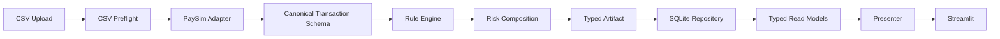

# Bank FDS Model

_Explainable Rule-Based Fraud Detection with SQLite Persistence and Streamlit Operations_

PaySim 합성 거래를 canonical schema로 표준화하고, 설명 가능한 5개 Rule의 거래 단위 Evidence와 판정 결과를 SQLite에 원자적으로 저장한 뒤 Streamlit에서 과거 Alert를 동일한 의미와 순서로 재조회하는 규칙 기반 금융 이상징후 탐지 포트폴리오입니다.

## 핵심 가치

- **설명 가능한 판정:** 최종 점수뿐 아니라 Rule별 원점수, reason, 거래 단위 Evidence를 제공합니다.
- **일관된 거래 정체성:** 입력 행을 canonical transaction ID로 연결해 분석부터 저장·재조회까지 의미를 보존합니다.
- **부분 실패 격리:** Rule 하나가 실패해도 성공한 Rule의 분석은 계속되고 오류가 별도로 기록됩니다.
- **원자적 저장:** 분석 run, 거래 snapshot, finding, Evidence, 오류를 하나의 SQLite 저장 경계에서 처리합니다.
- **운영 흐름 검증:** 신규 분석, 명시적 재분석, Alert 이력 및 상세 재조회를 Streamlit에서 제공합니다.

`bankruptcy_fds/`와 `scripts/app.py`는 별도 도메인 실험 및 legacy smoke UI입니다. 이 저장소의 주 포트폴리오 진입점은 아래 Bank FDS vertical slice입니다.

## Demo 화면


_Rapid와 Split이 동일한 3개 거래를 Evidence로 탐지하고 Policy B에 따라 최종 35/100으로 합성된 실제 Streamlit 결과입니다. 업로드와 Alert 재조회 화면은 [3~5분 Demo Guide](docs/demo-guide.md)에서 이어집니다._

## 빠른 실행

macOS/Linux에서 저장소 root를 기준으로 실행합니다. 별도 `PYTHONPATH` 설정은 필요하지 않습니다.

```bash
git clone https://github.com/NoahBhang/FDS_Model.git
cd FDS_Model

python3.11 -m venv .venv
source .venv/bin/activate
pip install -r requirements.txt

python -m streamlit run kaggle_bank_fds/src/ui/streamlit_app.py
```

기본 DB는 `~/.fds_model/bank_fds.sqlite3`입니다. 첫 실행에서 parent directory와 schema v1을 준비하며 앱 종료 후에도 DB는 유지됩니다. DB 파일은 Git에 포함하지 않습니다.

명시적인 DB 경로를 사용하려면:

```bash
BANK_FDS_DB_PATH=/absolute/path/bank_fds.sqlite3 \
python -m streamlit run kaggle_bank_fds/src/ui/streamlit_app.py
```

Windows PowerShell:

```powershell
$env:BANK_FDS_DB_PATH="C:\path\bank_fds.sqlite3"
python -m streamlit run kaggle_bank_fds/src/ui/streamlit_app.py
```

## Demo CSV

[`kaggle_bank_fds/examples/`](kaggle_bank_fds/examples/)의 합성 CSV를 Streamlit uploader에 바로 사용할 수 있습니다.

| 파일 | 목적 | 최종 위험점수 | 탐지 Rule | Alert |
|---|---|---:|---|---|
| [`clean.csv`](kaggle_bank_fds/examples/clean.csv) | 정상 분석 | 0/100 | 없음 | 미생성 |
| [`exact_overlap.csv`](kaggle_bank_fds/examples/exact_overlap.csv) | Rapid/Split Evidence 완전 중복 | 35/100 | Rapid, Split | 생성 |
| [`partial_overlap.csv`](kaggle_bank_fds/examples/partial_overlap.csv) | Rapid/Split 부분 중복 | 65/100 | Rapid, Split | 생성 |
| [`rounded_full_balance.csv`](kaggle_bank_fds/examples/rounded_full_balance.csv) | 독립 Rule 중첩 | 40/100 | FullBalance, Rounded | 생성 |

파일은 다음 명령으로 결정적으로 재생성할 수 있으며 generator output과 tracked CSV의 bytes가 테스트로 고정됩니다.

```bash
python kaggle_bank_fds/scripts/generate_demo_data.py
```

모든 예제는 자체 생성한 synthetic data입니다. 위험점수는 사기 발생 확률이 아닙니다.

## 사용자 Workflow

1. PaySim CSV를 업로드합니다.
2. 파일 크기, 행·열 수와 preview를 확인합니다.
3. 분석을 실행하고 0~100 규칙 기반 위험점수를 확인합니다.
4. 탐지 Rule의 원점수와 reason을 확인합니다.
5. Rule별 Evidence 거래를 확인합니다.
6. 저장된 위험 run은 Alert 이력에서 동일한 결과로 재조회합니다.

분석 run은 SQLite에 저장되며 clean run도 보존됩니다. clean run에는 Alert가 생성되지 않습니다. 일반 Streamlit rerun은 중복 분석을 만들지 않고, 같은 파일의 새 run은 **같은 파일 다시 분석** 버튼을 명시적으로 눌렀을 때만 생성됩니다.

## Architecture



- **Adapter Pattern:** PaySim 입력을 Rule이 공유하는 canonical schema로 변환합니다.
- **Canonical identity:** source position과 별개의 안정적인 transaction ID로 Evidence를 연결합니다.
- **Immutable artifact:** 분석 결과를 검증된 typed snapshot으로 저장 계층에 전달합니다.
- **Rule failure isolation:** 실패한 Rule을 기록하고 성공한 결과는 유지합니다.
- **Atomic persistence:** 한 분석의 저장을 하나의 SAVEPOINT로 처리합니다.
- **Semantic round-trip:** typed read model이 Rule/Evidence의 의미와 순서를 복원합니다.
- **Operation-scoped lifecycle:** UI 작업마다 repository를 열고 확실히 닫습니다.
- **Duplicate prevention:** 일반 rerun과 명시적 재분석을 구분합니다.

상세 설계는 [Architecture 문서](docs/architecture.md)를 참고하세요.

## Detection Rules

기본 Rule은 아래 순서로 매 실행마다 새 instance가 생성됩니다.

| 순서 | Rule ID | 사용자용 이름 | 탐지 패턴 | 원점수 | Evidence |
|---:|---|---|---|---:|---|
| 1 | `transfer_cash_out` | Transfer Cash-Out | Transfer 후 24 step 내 유사 금액 Cash-Out | 20 + pair당 5, 최대 40 | 매칭된 Transfer와 Cash-Out 거래 |
| 2 | `full_balance_transfer` | Full Balance Transfer | 이전 잔액의 99.9% 이상 Transfer | 15 + 건당 5, 최대 30 | 전액 이체 조건을 만족한 거래 |
| 3 | `rounded_amount` | Rounded Amount | 100,000 이상이며 10,000 단위인 Transfer/Cash-Out | 20 | 라운드 금액 거래 |
| 4 | `rapid_repeated_transfer` | Rapid Repeated Transfer | 동일 송·수신 계좌, 24 step 내 3건 이상, 합계 100,000 이상 | 30 | 해당 반복 이체 window의 거래 |
| 5 | `split_transaction` | Split Transaction | 동일 송신자의 100,000 미만 Transfer, 24 step 내 3건 이상·합계 200,000 이상 | 35 | 해당 분할 이체 window의 eligible 거래 |

## Score Composition

위험점수는 탐지된 Rule의 원점수를 합성한 0~100 규칙 기반 지표이며 사기 발생 확률이 아닙니다. 내부 값은 `0.0~1.0`, UI 표시는 `0~100` 형식입니다. 개별 Rule 원점수는 보존되며 risk level calibration은 적용하지 않습니다.

**Policy B:** Rapid와 Split의 canonical Evidence 집합이 비어 있지 않고 정확히 같으면 동일 패턴의 중복 반영을 줄이기 위해 두 점수의 합 대신 더 큰 점수만 최종점수에 반영합니다.

- Exact overlap: Rapid 30 + Split 35 → 최종 35
- Partial overlap: Rapid 30 + Split 35 → 최종 65
- Independent overlap: FullBalance 20 + Rounded 20 → 최종 40
- 모든 합성 결과는 100을 상한으로 제한합니다.

## Persistence Design

SQLite schema version 1은 다음 6개 table로 구성됩니다.

- `analysis_runs`
- `transaction_snapshots`
- `alerts`
- `rule_findings`
- `finding_evidence`
- `rule_execution_errors`

전체 분석 저장은 하나의 SAVEPOINT 안에서 수행되며 실패하면 해당 run 전체가 rollback됩니다. FK/CHECK/UNIQUE 제약으로 참조와 값 계약을 검증합니다. clean run도 저장하지만 위험 run만 Alert를 생성합니다. Evidence는 canonical transaction ID로 거래 snapshot에 연결되고 Rule/Evidence 순서가 보존됩니다. typed read model은 저장된 결과를 동일한 의미로 복원합니다.

`database/schema.sql`은 Bankruptcy legacy schema이며 이 Bank FDS schema v1의 근거가 아닙니다.

## CSV 입력 계약

UTF-8 CSV에 다음 PaySim column이 필요합니다.

```text
step
type
amount
nameOrig
oldbalanceOrg
newbalanceOrig
nameDest
oldbalanceDest
newbalanceDest
```

- 최대 10,000행, 20MiB
- extra column은 preflight에서 허용될 수 있으나 demo와 권장 형식은 위 9개 column만 사용
- 상세 dtype과 값 계약은 PaySim Adapter에서 검증
- 업로드 원본은 별도 디스크 파일로 저장하지 않음
- Evidence 화면 표시는 Rule별 최대 200건

## Testing

Bank FDS 앱 실행에는 `requirements.txt`만 필요합니다. ML training module을 import하는 전체 repository test suite를 실행하려면 개발·ML 의존성을 추가로 설치합니다.

```bash
pip install -r requirements-dev.txt
python -m pytest -q -p no:cacheprovider
```

2026-08-04 Portfolio Delivery Phase 5 기준 fresh Python 3.11 환경에서 1,119개 테스트를 통과했습니다. 테스트 수는 기능 추가에 따라 변경될 수 있습니다. 검증 범위에는 model validation, Rule overlap, canonical Evidence, schema migration, atomic rollback, SQL injection 방어, corruption detection, N+1 방지, Streamlit AppTest, rerun 중복 저장 방지, headless runtime smoke, demo semantic contract가 포함됩니다.

## Performance Notes

M5 Mac 로컬 개발 환경의 10,000행 synthetic fixture에서 CSV parse부터 분석·SQLite 저장·typed 재조회·presenter 변환까지 약 0.68초가 측정됐습니다. 이는 운영 SLA나 일반 benchmark가 아니며 입력 패턴과 환경에 따라 달라집니다. 10,000 Evidence 상세 조회는 SELECT 7회로 검증했고 화면에는 최대 200건만 materialize합니다. 일반 rerun은 run/Alert 수를 증가시키지 않습니다.

## Project Structure

```text
FDS_Model/
├── kaggle_bank_fds/
│   ├── examples/
│   ├── scripts/
│   ├── src/
│   │   ├── adapters/
│   │   ├── models/
│   │   ├── persistence/
│   │   ├── rules/
│   │   ├── services/
│   │   └── ui/
│   └── tests/
├── bankruptcy_fds/          # 별도 도메인 실험
├── scripts/app.py           # legacy smoke UI
├── docs/
├── LICENSE
└── requirements.txt
```

## Portfolio v1 Scope

구현 범위는 Rule-based detection, explainable Evidence, canonical transaction identity, SQLite persistence, Streamlit operations UI, Alert history, Rule failure isolation, typed semantic round-trip입니다.

다음은 Portfolio v1의 명시적 비목표입니다: calibrated ML probability, authentication/authorization, 개인정보 masking/encryption, Alert status workflow, 검색·pagination, multi-user concurrency, external production DB, real bank data, deployment/monitoring, 법률·컴플라이언스 검증.

## Data Source and License

PaySim 형식의 합성 거래 스키마를 사용합니다. 포함된 예제 CSV는 본 프로젝트가 자체 생성한 synthetic demo이며 실제 고객·계좌·은행 정보가 없습니다. 외부 PaySim 원본의 출처·라이선스 상세는 저장소 내 근거를 추가 확인한 뒤 문서화할 항목입니다.

프로젝트 코드는 [MIT License](LICENSE)를 따릅니다.

## Further Reading

- [Architecture](docs/architecture.md)
- [3~5분 Demo Guide](docs/demo-guide.md)
- [Demo CSV 안내](kaggle_bank_fds/examples/README.md)
