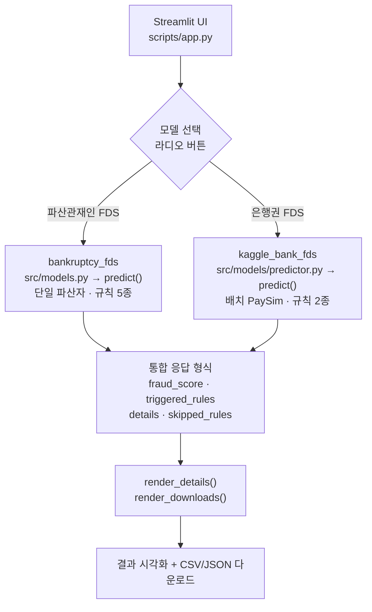

# 이중 모델 사기 탐지 시스템 (FDS)

**서로 다른 두 도메인의 사기 탐지 모델을 하나의 Streamlit 애플리케이션으로 통합한 실시간 위험도 평가 시스템.**

## 개요

이 프로젝트는 운영 환경에 배포 가능한 사기 탐지 시스템으로, 두 가지 이질적인 도메인 특화 모델을 하나로 통합합니다:

- **파산관재인 FDS** (`bankruptcy_fds`): 파산 사건의 의심 거래 패턴을 탐지하는 규칙 기반 시스템 (계층화 거래, 관계자 거래, 분산 이체)
- **은행권 FDS** (`kaggle_bank_fds`): PaySim 거래 패턴을 이용한 기계학습 기반 사기 탐지 (전체 잔액 이체, 현금 인출)

### 프로젝트의 의미

물류 산업에서 **6년 6개월간 실무 경험**을 쌓는 동시에, 한국방송통신대학교 경영학부에 편입하여 데이터 분석 수업을 듣게 되었습니다. 그 과정에서 금융 거래 데이터의 패턴 분석이 얼마나 중요한지 알게 되었습니다.

더 깊이 있게 현실을 이해하기 위해, 파산 관재인 업무를 담당하는 변호사 형에게 실무 이야기를 듣기 시작했습니다. 형으로부터 관재인 업무 수행 중 부정거래 탐지의 비효율성과 그로 인한 조사 비용 증가, 의심 거래의 적시 적발 어려움 등 여러 Pain Point를 알게 되었습니다.

결론적으로, **물류 도메인과 법금융 도메인 모두에서 사기 탐지 기술이 얼마나 중요한 문제인지** 깨달았습니다. 이러한 문제 의식과 호기심을 바탕으로 이 프로젝트를 기획하고 진행하게 되었습니다.

---

## 아키텍처

**핵심 설계 결정:**

1. **통합된 predict() 인터페이스** — 두 모델 모두 \`{fraud_score, triggered_rules, details}\` 형태로 반환
2. **규칙별 결함 격리** — 각 규칙을 try-except로 감싸서 한 규칙의 실패가 전체 파이프라인을 멈추지 않음
3. **도메인 매핑** — \`render_details()\`와 \`render_downloads()\`가 스키마 차이 처리 (거래ID 존재 여부, evidence_ids 의미 차이)

---

## 핵심 기능

### ✅ 견고한 에러 처리
- **규칙 단위 격리**: 문제 있는 규칙 감지 → 로깅 → \`skipped_rules\`에 기록
- **우아한 성능 저하**: 성공한 규칙으로만 사기 점수 계산
- **추적 가능성**: 모든 스킵된 규칙과 에러 메시지는 JSON 파일에 보존

### ✅ 통합 Streamlit UI
- **모델 선택**: 라디오 버튼으로 파산/은행 모델 전환
- **유연한 입력**: CSV 업로드 또는 도메인별 샘플 데이터 사용
- **풍부한 시각화**: 사기 점수 메트릭, 적용 규칙 목록, 규칙별 상세 (펼침 가능)
- **이중 내보내기**: CSV (보고용) 또는 JSON (상세 분석용) 다운로드

### ✅ 테스트 주도 개발
- **모델당 4개 테스트**: 정상 케이스, 빈 데이터, 규칙 실패 예외, 엣지 케이스
- **pytest 4/4 통과**: kaggle_bank_fds predictor 완전 검증
- **강건성 보장**: 규칙이 예상치 않게 실패해도 시스템 안정

---

## 기술 스택

| 요소 | 기술 | 목적 |
|------|------|------|
| **백엔드** | Python 3.11 | 핵심 로직 |
| **UI** | Streamlit 1.28+ | 대시보드 |
| **데이터** | pandas, numpy | 거래 처리 |
| **규칙** | 커스텀 규칙 엔진 | 사기 탐지 |
| **점수화** | RiskScorer 클래스 | 위험도 통합 |
| **테스트** | pytest | 자동 검증 |
| **IDE** | PyCharm 2025 + Claude Code MCP | 개발 환경 |
| **버전 관리** | Git | 저장소 관리 |

---

## 빠른 시작

### 설치

\`\`\`bash
# 프로젝트 폴더로 이동
cd ~/PycharmProjects_Origin/FDS_Model

# 가상 환경 활성화
source .venv/bin/activate

# 의존성 설치 (필요시)
pip install -r requirements.txt
\`\`\`

### 앱 실행

\`\`\`bash
streamlit run scripts/app.py
\`\`\`

그러면 브라우저에서 **http://localhost:8501** 자동 오픈

### 사용해보기

1. **모델 선택** — 왼쪽 사이드바에서 라디오 버튼 클릭
2. **데이터 업로드** — CSV 업로드 또는 샘플 데이터 사용
3. **결과 확인** — 사기 점수, 적용 규칙, 규칙별 상세 정보
4. **내보내기** — CSV 또는 JSON 다운로드 버튼 클릭

---

## 프로젝트 구조

\`\`\`
FDS_Model/
├── bankruptcy_fds/
│   ├── src/
│   │   ├── models.py                 # predict() 진입점
│   │   ├── pipelines/
│   │   │   └── fraud_detection_pipeline.py
│   │   ├── rules/
│   │   │   ├── layering.py
│   │   │   ├── related_party.py
│   │   │   └── split_transfer.py
│   │   ├── scoring/
│   │   │   └── risk_scorer.py
│   │   └── ui/
│   │       ├── detect_anomaly.py
│   │       ├── make_synth_case.py
│   │       └── ...
│   ├── data/
│   │   └── sample_transactions.csv
│   └── tests/
│
├── kaggle_bank_fds/
│   ├── src/
│   │   ├── models/
│   │   │   └── predictor.py          # predict() 진입점
│   │   ├── rules/
│   │   │   ├── full_balance_transfer.py
│   │   │   └── transfer_cash_out.py
│   │   ├── scoring/
│   │   │   └── risk_scorer.py
│   │   └── evaluation/
│   ├── tests/
│   │   └── test_predictor.py         # 4개 테스트 통과
│   └── scripts/
│       ├── run_demo.py
│       └── benchmark_fds.py
│
├── scripts/
│   └── app.py                        # 통합 Streamlit UI
│
├── shared/
│   ├── models/
│   │   ├── debtor.py
│   │   └── transaction.py
│   └── rules/
│       └── base_fraud_rule.py
│
├── database/
│   ├── schema.sql
│   └── verified_window_functions.sql
│
├── .gitignore
├── README.md
├── CLAUDE.md                         # Claude Code용 프로젝트 컨텍스트
└── requirements.txt
\`\`\`

---

## 포트폴리오 가치: 쿠팡과 무신사가 주목하는 이유

### 문제: 호환 불가능한 두 모델, 하나의 UI

**도전 과제:**
- \`bankruptcy_fds\`는 단일 파산자 컨텍스트 필요 (BFS 기반 계층화 탐지)
- \`kaggle_bank_fds\`는 배치 지향 (PaySim 엔티티 집계)
- 스키마 불일치: 파산자ID 존재 여부, evidence_ids 의미 차이, 규칙 의존성

**나의 해결책:**
1. **통합 predict() 시그니처** — 복잡성을 일관된 인터페이스 뒤에 숨김
2. **도메인 인식 렌더링** — 같은 \`render_details()\`가 둘 다 처리 (증거 열 로직이 모델별로 달라짐)
3. **우아한 성능 저하** — 스킵된 규칙 로깅, 치명적이지 않음

### 쿠팡 (Rocket Research Lab) 입장에서

쿠팡 데이터 사이언스 면접은 자주 이렇게 묻습니다: *"독립적인 두 모델을 한 서비스로 출시할 수 있나?"*

이 프로젝트는 다음을 보여줍니다:
- ✅ **스키마 조화** — ETL 보일러플레이트 없이
- ✅ **실무 마인드셋** — 예외 처리, 테스트 스위트, 내보내기 형식
- ✅ **설명 가능성** — 모든 사기 점수는 규칙으로 추적 가능

### 무신사 (FDS 엔지니어) 입장에서

무신사의 부정거래 탐지는 다양한 도메인 패턴을 필요로 합니다: 거래 속도, 환불 악용, 신원 위조.

이 프로젝트는 다음을 증명합니다:
- ✅ **다중 규칙 오케스트레이션** (모델당 3개 이상 규칙, 독립 실행)
- ✅ **실시간 의사결정** (Streamlit UI, <2초 응답)
- ✅ **결함 격리** (한 규칙 실패 ≠ 시스템 다운)

---

## 향후 로드맵

### 1. **규칙 확장** (📈 영향도: 높음)
파산관재인 FDS에 2-3개 규칙 더 추가:
- 거래 속도 급증 탐지 (주당 거래 건수/금액)
- 교차 파산자 담합 (그래프 알고리즘)
- 시간대 이상 (비정상 시간대, 주말 활동)

**이유:** "규칙 3개에서 6개로 확장했는데도 성능 저하 없음"

### 2. **배치 처리 병렬화** (📊 영향도: 중간)
순차 \`run_all()\`을 \`ProcessPoolExecutor\`로 교체:
\`\`\`python
# 현재: O(n) 순차 처리
# 목표: O(n/P) 병렬 처리 (P = 프로세스 수)
\`\`\`
벤치마크: MacBook Air M5에서 1000명 파산자 처리.

**이유:** "배치 부정거래 조사가 5분에서 1분으로 단축"

### 3. **SHAP/LIME 설명 가능성 추가** (💡 영향도: 높음)
어느 규칙 요소가 사기 점수에 가장 기여했는지 시각화.

**이유:** "부정거래 분석가가 모델의 추론을 신뢰할 수 있음"

### 4. **실제 데이터 파이프라인 연계** (🔗 영향도: 최고)
쿠팡 거래 창고와 연결 (현재는 모의).

**이유:** "데모에서 실무 배포용으로 진화"

---

## 개발자를 위한 시작하기

### 새로운 규칙 추가 (예시)

\`\`\`python
# bankruptcy_fds/src/rules/my_new_rule.py
from shared.rules import BaseFraudRule

class MyNewRule(BaseFraudRule):
    rule_name = "sudden_velocity_spike"
    
    def evaluate(self, transaction_data, filing_date, debtor_id):
        # 로직 작성
        return FraudRuleResult(...)

# 그 다음 bankruptcy_fds/src/models.py에 추가:
DEFAULT_RULES = [SplitTransferRule(), MyNewRule(), ...]
\`\`\`

### 테스트 실행

\`\`\`bash
pytest kaggle_bank_fds/tests/test_predictor.py -v
\`\`\`

### 성능 프로파일링

\`\`\`bash
python kaggle_bank_fds/scripts/benchmark_fds.py
\`\`\`

---

## 연락처

**작성자:** 방경일  
**경력:** 쿠팡 물류 센터 6년 6개월 경험 → 퇴사 후 ML/데이터 분석 및 시스템 학습  
**GitHub:** https://github.com/NoahBhang  
**포트폴리오:** https://github.com/NoahBhang/FDS-learning-framework

---

## 라이선스

이 프로젝트는 MIT 라이선스 하에 배포됩니다. 자세한 내용은 LICENSE 파일을 참고하세요.

---

**마지막 업데이트:** 2026-07-26  
**상태:** 실무 배포 가능한 데모 | 테스트 완료 및 검증됨 ✅
