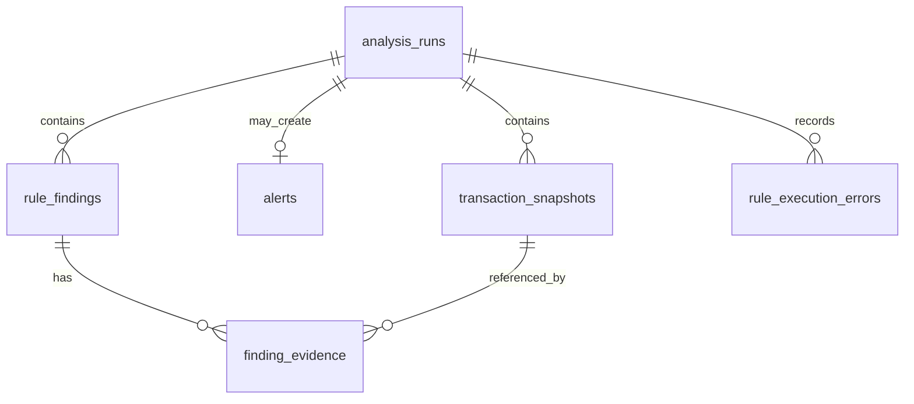

# Bank FDS Architecture

## 1. System Context

Bank FDS vertical slice는 PaySim 형식의 합성 거래 CSV를 입력받아 설명 가능한 Rule 결과를 만들고, 이를 SQLite에 저장한 뒤 Streamlit에서 Alert 이력과 상세 Evidence로 재조회합니다. 외부 인증, 실시간 event ingestion, 외부 production DB는 v1 범위가 아닙니다.

## 2. End-to-End Data Flow

```mermaid
flowchart LR
    U["User"] --> UI["Streamlit Operations UI"]
    UI --> P["CSV Preflight"]
    P --> A["PaySim Adapter"]
    A --> C["Canonical Transactions"]
    C --> R["Rule Engine · 5 Rules"]
    R --> S["Risk Composition · Policy B"]
    S --> T["Typed Persistence Artifact"]
    T --> W["SQLite Repository"]
    W --> M["Typed Read Models"]
    M --> V["Presenters"]
    V --> UI
```

업로드 bytes는 UTF-8, 크기, 행 수, header를 사전 검사합니다. 이후 adapter가 raw PaySim 필드를 canonical transaction으로 변환하고 Rule Engine이 격리된 실행 결과를 만듭니다. facade는 score를 합성하며 persistence builder가 동일 실행 결과를 immutable artifact로 만듭니다.

## 3. Layer Responsibilities

| Layer | 책임 |
|---|---|
| `ui` | 업로드, session action token, 렌더링, operation lifecycle |
| `adapters` | raw schema 검증과 canonical transaction 변환 |
| `rules` | 독립 탐지와 거래 Evidence 생성 |
| `models` | 기본 Rule 구성, 호환 facade, score composition |
| `services` | 한 번 분석하고 저장한 뒤 typed 결과 재조회 |
| `persistence` | artifact validation, atomic write, typed reads |

UI와 generator는 Rule 계약을 다시 구현하지 않습니다. Demo의 의미 검증은 public service 경로를 사용하는 테스트가 담당합니다.

## 4. Canonical Transaction Identity

입력 DataFrame의 label은 중복되거나 타입이 다를 수 있으므로 Evidence identity로 직접 사용하지 않습니다. Adapter는 positional source identity를 기반으로 run 내부에서 유일한 `canonical_transaction_id`를 만듭니다. `source_position`과 원래 `source_row_id`도 별도로 보존합니다.

Rule Evidence는 canonical transaction ID로 artifact의 transaction snapshot을 참조합니다. 이 ID는 Rapid/Split exact Evidence set 비교와 SQLite `finding_evidence` 연결의 공통 기준입니다.

## 5. Rule Execution and Failure Isolation

기본 실행 순서는 TransferCashOut, FullBalanceTransfer, RoundedAmount, RapidRepeatedTransfer, SplitTransaction입니다. 호출마다 fresh Rule instance를 구성하고 명시적인 custom rules는 기본 목록을 완전히 대체합니다.

Rule Engine은 각 Rule의 성공 결과와 오류를 분리합니다. 한 Rule의 예외가 다른 Rule의 finding을 폐기하지 않으며 오류는 `rule_execution_errors`에 안전한 형태로 저장됩니다. 성공 finding과 Evidence의 실행 순서는 유지됩니다.

## 6. Score Composition

성공한 triggered Rule의 정수 원점수를 합성하고 100에서 cap한 뒤 facade의 `0.0~1.0` 값으로 변환합니다. Rapid와 Split이 모두 triggered이고 양쪽 canonical Evidence ID 집합이 비어 있지 않으며 정확히 같은 경우에만 Policy B를 적용합니다. 이때 두 점수의 합이 아니라 큰 점수 하나를 반영합니다.

부분 중복, 포함 관계, 빈 Evidence, 다른 Rule pair에는 할인을 적용하지 않습니다. Rule의 원점수, triggered 목록, detail, Evidence는 변경하지 않습니다.

## 7. Typed Persistence Artifact

Persistence builder는 prediction과 동일한 Rule 실행을 기반으로 다음 immutable snapshot을 구성합니다.

- 분석 metadata와 최종 score
- canonical transaction snapshots
- Rule finding과 execution order
- finding별 canonical Evidence ID tuple
- 격리된 Rule execution errors

Dataclass validation이 범위, 필수 문자열, 고유 Evidence, 순서 및 triggered/score 일관성을 DB write 전에 검사합니다.

## 8. SQLite Schema v1

- `analysis_runs`: source, ruleset, 입력/결과 count와 최종 score
- `transaction_snapshots`: run 내부 canonical 거래와 source identity
- `alerts`: 위험 run당 최대 하나의 Alert
- `rule_findings`: run과 Rule ID/실행 순서당 하나의 finding
- `finding_evidence`: finding과 transaction snapshot을 순서 있게 연결
- `rule_execution_errors`: run과 Rule당 최대 하나의 격리 오류

FK는 `analysis_run_id` 경계를 포함하고 삭제 시 cascade됩니다. UNIQUE 제약은 run 내부 transaction identity, Rule ID, execution order 및 Evidence 중복을 방지합니다.

## 9. Atomic Save Boundary

Repository는 `SAVEPOINT fds_save_analysis` 안에서 run, transactions, optional Alert, findings, Evidence, errors를 순서대로 기록합니다. 어떤 insert나 제약 검증이 실패해도 SAVEPOINT까지 rollback하므로 부분 run이 남지 않습니다. Schema 초기화도 별도의 원자적 SAVEPOINT를 사용합니다.

## 10. Semantic Round-Trip

저장 직후 service는 analysis run을 다시 읽고 Alert 생성 여부를 artifact 의미와 대조합니다. 위험 run은 Alert summary와 detail까지 typed model로 복원합니다. 상세 조회는 finding과 Evidence를 명시적 execution/evidence order로 조립하므로 UI가 저장 전과 같은 Rule 순서와 거래 의미를 표시합니다.

## 11. Streamlit Lifecycle

각 schema 준비, 분석, Alert 조회 작업은 operation-scoped repository context 안에서 실행되어 connection이 확실히 닫힙니다. 업로드 bytes의 SHA-256 fingerprint와 session action token이 일반 rerun을 명시적 분석 action과 구분합니다. 같은 파일을 다시 분석하려면 전용 버튼이 필요합니다.

기본 DB는 `~/.fds_model/bank_fds.sqlite3`이고 `BANK_FDS_DB_PATH`로 변경할 수 있습니다. 앱은 parent directory를 준비하고 schema version을 검증합니다.

## 12. Failure Paths

- 잘못된 확장자, UTF-8, 크기, 행 수, 필수 column: 사용자 수정 가능한 preflight 오류
- Adapter dtype/value 오류: 분석 전에 중단
- 개별 Rule 예외: 나머지 Rule 계속 실행, 오류 snapshot 저장
- schema version/corruption/SQLite 오류: 성공 상태로 표시하지 않고 repository 종료
- artifact와 read-back 불일치: service integrity 오류
- UI 오류: 내부 계좌나 traceback을 노출하지 않는 사용자 메시지

## 13. Performance Characteristics

Rapid/Split은 정렬 기반 경로를 사용하고 overlap 비교는 Evidence ID set 크기에 비례합니다. Persistence detail read는 row별 query가 아닌 고정된 query 집합으로 조립됩니다. 10,000 Evidence 상세 조회는 SELECT 7회이며 UI는 최대 200행만 materialize합니다.

M5 Mac의 10,000행 synthetic fixture에서 end-to-end 약 0.68초가 관찰됐지만 운영 SLA나 일반 benchmark가 아닙니다. 입력 분포, SQLite storage 및 실행 환경에 따라 변합니다.

## 14. Deliberate v1 Boundaries

v1은 calibrated probability, 인증·권한, 개인정보 masking/encryption, Alert 상태 변경 workflow, 검색·pagination, 다중 사용자 동시성, 외부 DB, 실데이터, 배포·monitoring, 법률·컴플라이언스 검증을 제공하지 않습니다. 이 경계는 현재 설명 가능한 vertical slice의 의미를 명확히 하기 위한 선택입니다.
