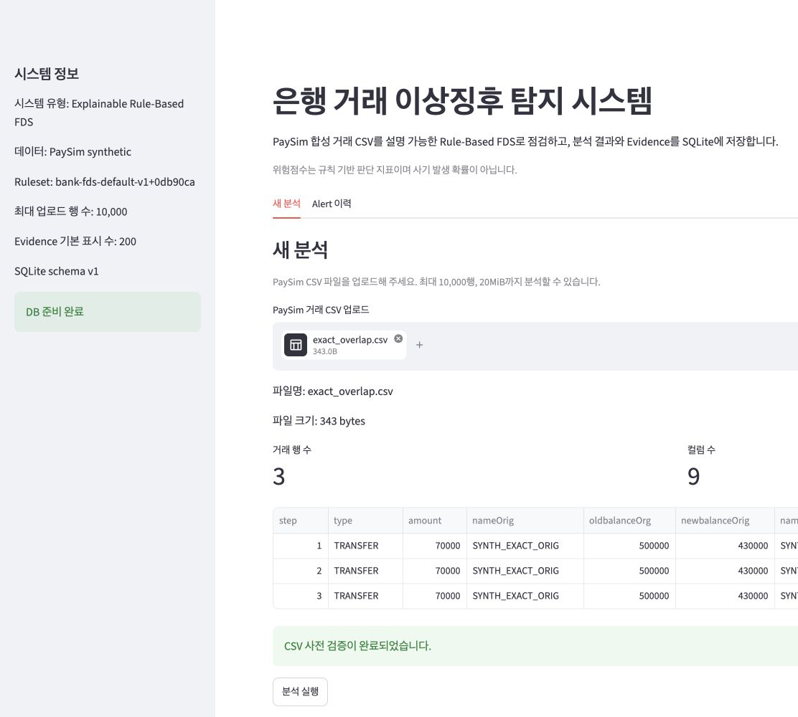
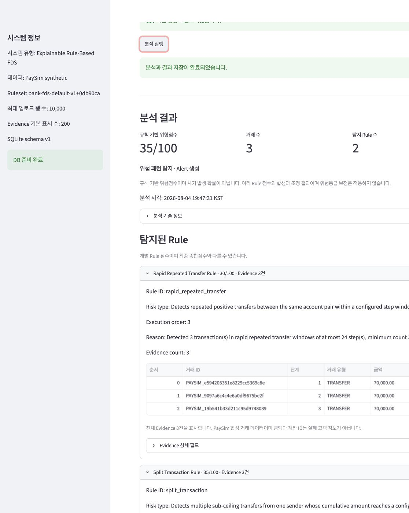
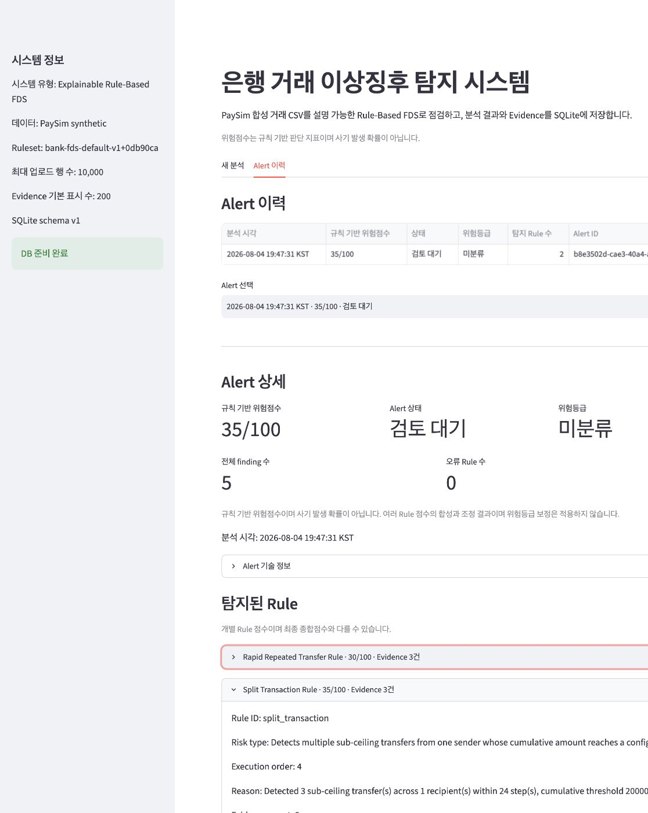

# Bank FDS 3~5분 Demo Guide

## 1. Demo 목적

합성 PaySim CSV 한 개가 canonical 거래, 설명 가능한 5개 Rule, Policy B 점수 합성, SQLite 저장, Alert 상세 재조회까지 같은 의미로 흐르는 과정을 보여줍니다.

## 2. 준비

저장소 root에서 의존성을 설치하고 demo CSV가 있는지 확인합니다.

```bash
pip install -r requirements.txt
python kaggle_bank_fds/scripts/generate_demo_data.py
```

예제는 deterministic synthetic data이며 실제 고객·계좌 정보가 없습니다. 위험점수는 사기 발생 확률이 아닙니다.

## 3. 앱 실행

Demo 전용 DB 경로를 지정하면 기존 이력과 분리할 수 있습니다.

```bash
BANK_FDS_DB_PATH=/private/tmp/bank-fds-demo/bank_fds.sqlite3 \
python -m streamlit run kaggle_bank_fds/src/ui/streamlit_app.py
```

## 4. Exact Overlap 시연

새 분석 화면에서 `kaggle_bank_fds/examples/exact_overlap.csv`를 업로드합니다. 3개 행, 9개 column과 preview를 확인하고 **분석 실행**을 누릅니다.



_`exact_overlap.csv` 업로드 후 3개 거래와 9개 PaySim 필수 컬럼을 확인한 화면입니다._

발화 예시: “동일 송신자와 수신자 사이의 70,000원 이체 세 건이 24 step 안에 있습니다. 각 거래는 100,000원 미만이고 총액은 210,000원입니다.”

## 5. 35/100 설명

최종 위험점수는 `35/100`입니다. Rapid 원점수 30과 Split 원점수 35가 모두 보이지만, 두 Rule의 canonical Evidence 집합이 정확히 같아 Policy B가 합계 65가 아닌 큰 점수 35만 반영합니다.



_Rapid와 Split이 동일한 3개 거래를 Evidence로 탐지하고 Policy B에 따라 최종 35/100으로 합성된 결과입니다._

## 6. Rule 원점수 확인

Rule detail에서 다음을 확인합니다.

- `rapid_repeated_transfer`: 30/100
- `split_transaction`: 35/100
- 두 Rule 모두 triggered 목록에 기본 실행 순서로 존재
- 각 Rule reason과 원점수는 할인 후에도 보존

## 7. Canonical Evidence 확인

두 Rule의 Evidence 표를 열어 동일한 세 거래와 동일한 순서를 확인합니다. 화면의 Evidence는 단순 DataFrame label이 아니라 저장 가능한 canonical transaction identity로 연결됩니다.

## 8. Alert 이력 이동

Alert 이력 탭으로 이동해 방금 생성한 `35/100` Alert를 선택합니다. 일반 rerun만으로 새 run이나 Alert가 생성되지 않는 점도 설명합니다.

## 9. 저장 결과 재조회

상세 화면에서 최종 score, triggered Rule, reason, Rule 원점수, Evidence 순서가 신규 분석 화면과 같은지 확인합니다. 이 화면은 session에 남은 원본 prediction이 아니라 SQLite typed read model에서 복원된 결과입니다.



_SQLite에 저장된 Alert를 이력 화면에서 선택해 동일한 Rule과 Evidence 순서로 재조회한 화면입니다._

## 10. Architecture 설명 포인트

1. PaySim Adapter가 raw column을 canonical schema로 표준화합니다.
2. Rule Engine이 5개 Rule을 격리 실행합니다.
3. Policy B는 canonical Evidence exact equality에만 적용됩니다.
4. Immutable typed artifact가 저장 전 계약을 검증합니다.
5. Repository는 한 run을 SAVEPOINT로 원자 저장합니다.
6. Typed read model과 presenter가 의미와 순서를 복원합니다.

상세 흐름은 [Architecture](architecture.md)에 있습니다.

## 11. Testing 설명 포인트

```bash
pip install -r requirements-dev.txt
python -m pytest -q -p no:cacheprovider
```

2026-08-04 Portfolio Delivery Phase 5 기준 fresh Python 3.11 환경에서 1,133개 테스트를 통과했습니다. 이 suite는 model/Rule, Policy B, canonical Evidence, atomic rollback, schema corruption, SQL injection, typed round-trip, Streamlit lifecycle 및 demo semantics를 포함합니다. 테스트 수는 기능 추가에 따라 달라질 수 있습니다.

## 12. 대체 시나리오

| 파일 | 보여줄 계약 | 결과 |
|---|---|---:|
| `clean.csv` | clean run 저장, Alert 미생성 | 0/100 |
| `partial_overlap.csv` | Evidence 집합이 다르면 할인 없음 | 65/100 |
| `rounded_full_balance.csv` | 다른 Rule의 동일 거래 탐지는 독립 합산 | 40/100 |

## 13. 실패 방지 Checklist

- 저장소 root에서 실행했는가
- `.venv`가 활성화되고 requirements가 설치됐는가
- demo CSV를 수정하지 않았는가
- DB parent에 쓰기 권한이 있는가
- 기존 demo DB가 필요하면 시작 전에 별도 경로를 선택했는가
- 점수를 확률이나 확정 판정으로 설명하지 않았는가
- 일반 rerun과 **같은 파일 다시 분석** 버튼을 구분했는가
- 시연 후 Streamlit process를 종료했는가
